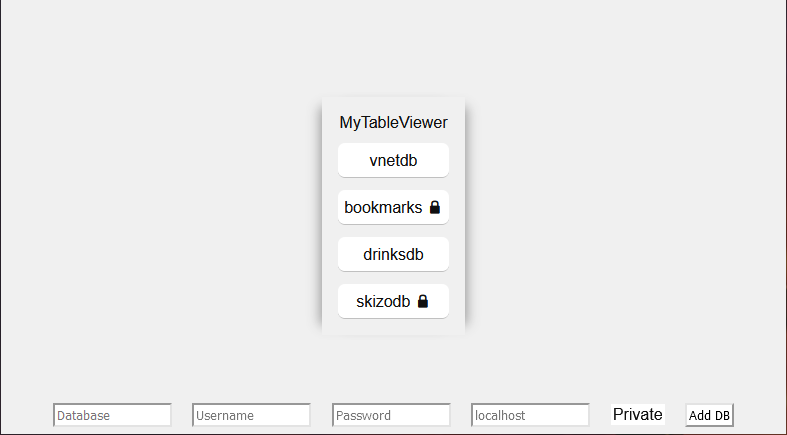
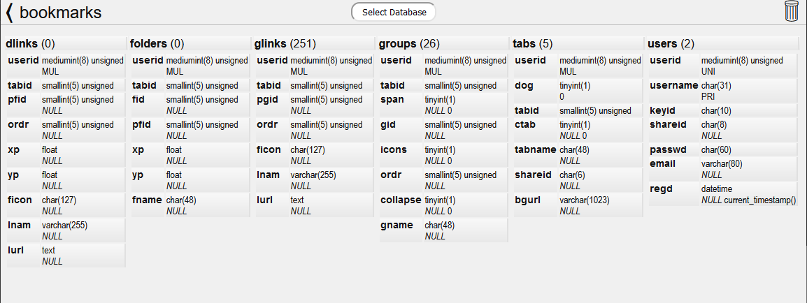

# MyTableViewer
__A single page, ultra minimalist, read-only database table viewer.__\
Written in PHP for MySQL / MariaDB databases.

__Qualities__\
View the contents of your databases utilizing every inch of your screen without the clutter of UI controls.\
Sort columns client-side.\
Code is simple and small, easy to edit. No compilation required.

## Usage
* The welcome screen will display only a list of databases you have added.
* To add a new database, hover your cursor at the bottom of the screen.
  - If hostname is left blank, it will default to localhost.
  - The 'private' toggle switch will set a cookie that makes that database only viewable to you. Otherwise anyone who visits this page can see it. This is denoted by a lock icon next to it in the database list.
  - Remove a database by clicking on it, then clicking the trash icon in the top right.
* Hover over the database name to see the user and hostname.\
__Table Schemas__
* Click on a table name header to pull data from that table.
* Right-Click on a table name header to get the exact row count (default is db's estimate).\
__Table Data__
* Click on a column header to sort the table (nulls at bottom).
* Right-Click on a column header to sort the table numerically (nulls at bottom).

Empty string values are not sorted to the bottom like true nulls. In ascending order, empty strings will be at the top, so you can tell them apart from the nulls at the bottom.

The database credential cache is stored in /tmp/MyTableViewer and is readable (0600) only to your webserver user (e.g. www-data).

  

### Releases
There is no code to assemble, so you can use this permanent link to the raw file [MyTableViewer.php](https://raw.githubusercontent.com/Voldrix/MyTableViewer/master/MyTableViewer.php)

## Contributing
Feel free to contribute. Just keep in mind we're trying to keep it simple, with minimal UI.

## License
[MIT License](LICENSE)
