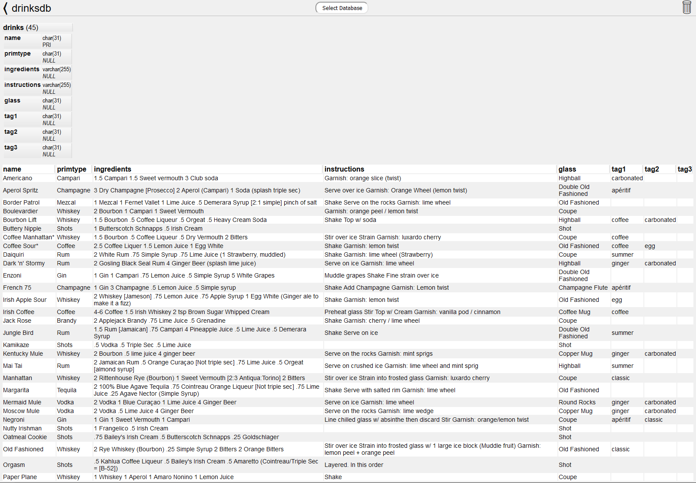

# MyTableViewer
__A single page, ultra minimalist, read-only database table viewer.__\
Written in PHP for MySQL / MariaDB databases.

## Description
View the contents of your databases utilizing every inch of your screen without the clutter of UI controls.\
Sort columns client-side.\
Code is clear and easy to edit. No compilation required.

## Usage
* The welcome screen will display only a list of databases you have added.
* To add a new database, hover your cursor at the bottom of the screen.
  - If hostname is left blank, it will default to localhost.
  - The 'private' toggle switch will set a cookie that makes that database only viewable to you. Otherwise anyone who visits this page can see it. This is denoted by a lock icon next to it in the database list.
  - Remove a database by clicking on it, then clicking the trash icon in the top right.
* Click on a table name header to pull and display that table below.
* Click on a table's column header to sort the table client-side.
* Hover over the database name to see the user and hostname.

The database credential cache is stored in /tmp/MyTableViewer and is readable (0600) only to your webserver user (e.g. www-data).

  

### Releases
There is no code to assemble, so you can use this permanent link to the raw file [MyTableViewer.php](https://raw.githubusercontent.com/Voldrix/MyTableViewer/master/MyTableViewer.php)

## Contributing
Feel free to contribute. Just keep in mind we're trying to keep it as simple and clean as possible.

## License
[MIT License](LICENSE)
